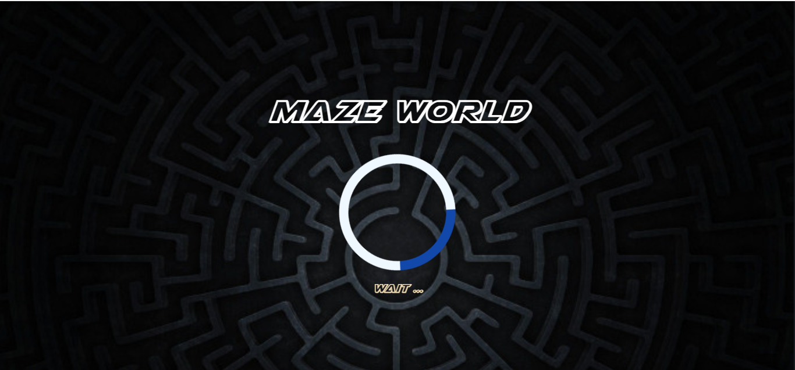
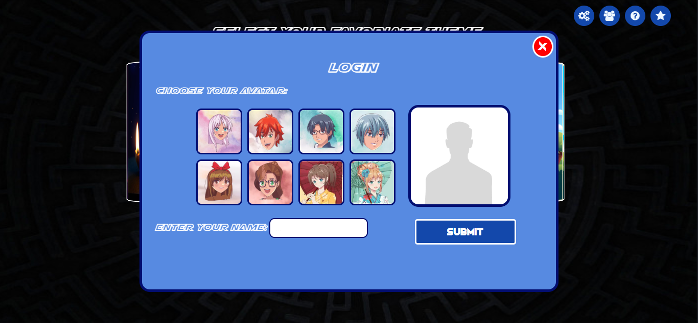
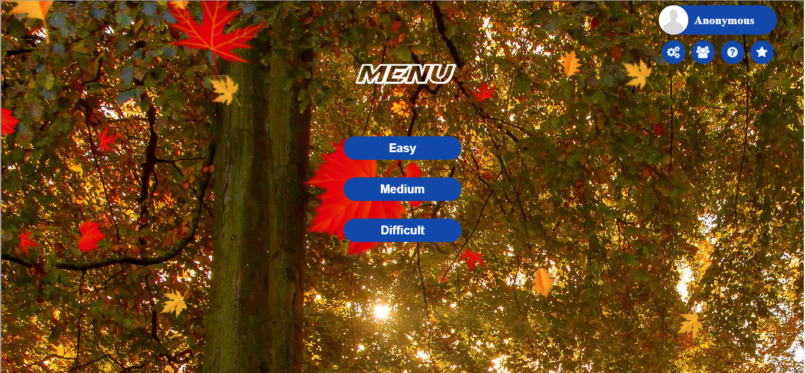
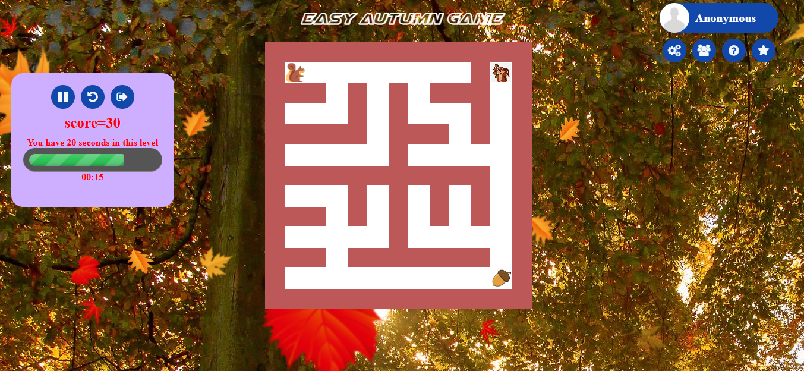
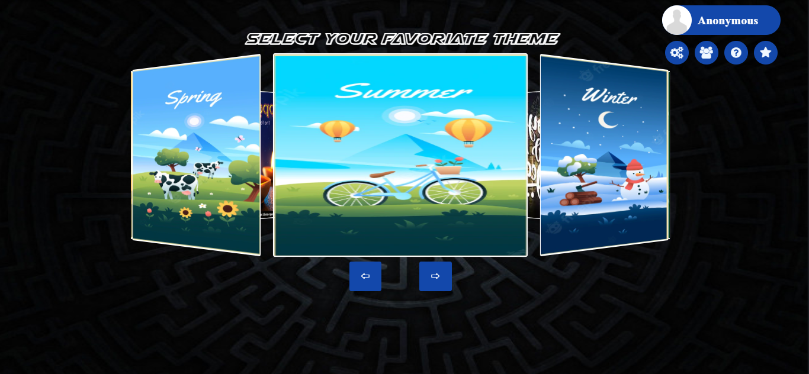
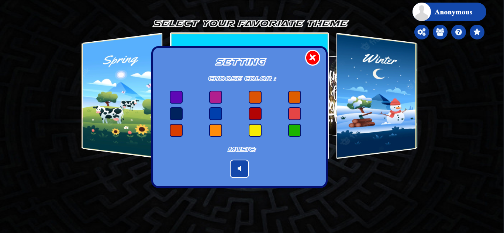
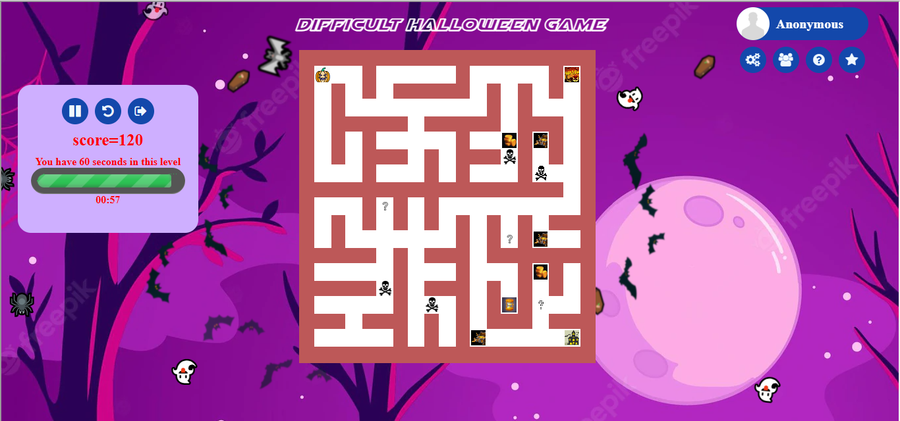
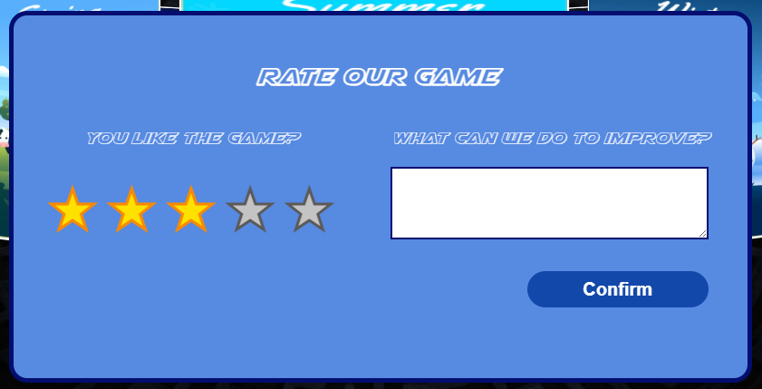
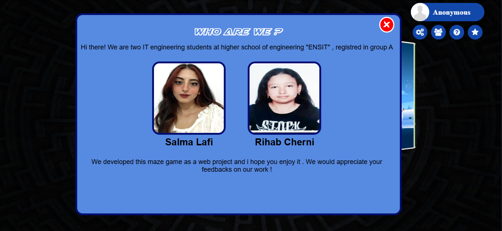
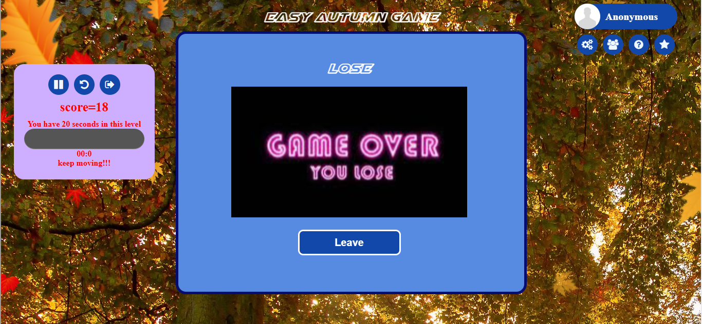

# Maze World Game

A captivating web-based maze game featuring multiple difficulty levels, seasonal themes, and engaging gameplay mechanics. Navigate through challenging mazes while collecting treasures and avoiding obstacles!

## 🎮 Game Features

### Difficulty Levels
- **Easy**: Simple maze navigation - find your way to the exit
- **Medium**: Navigate mazes while collecting bonus items and avoiding penalties
- **Difficult**: Advanced gameplay with moving enemies and complex challenges

### Game Elements
- **Collectible Items**:
  - 🏆 Treasure chests: +5 gold coins
  - ⏰ Time bonuses: +5 seconds
  - 💀 Penalty items: -3 gold coins
  - 🎲 Mystery items: Random effects (gain/lose coins or return to start)
- **Enemies**: Moving threats that chase the player (difficult mode)
- **Timer System**: Race against time to complete each level
- **Scoring System**: Based on steps taken and remaining time

## 🎨 Themes & Customization

### Available Themes
- 🍂 Autumn
- 🌸 Spring  
- ☀️ Summer
- ❄️ Winter
- 🎄 Christmas
- 🎊 New Year
- 🎃 Halloween
- 🪔 Diwali

### Customization Options
- **Avatar Selection**: Choose from 8 different avatars
- **Color Schemes**: 12 different UI color options
- **Background Music**: Toggle game soundtrack on/off
- **Personalization**: Custom player names

## 📸 Game Screenshots

### Loading Screen
*Initial loading screen with game branding*

### User Profile & Login

- Avatar selection gallery
- Username customization
- Profile management

### Main Menu & Navigation
*Main menu with difficulty selection and navigation options*

### Game Controls & Gameplay

- **Play/Pause**: Pause and resume gameplay
- **Restart**: Reset current level
- **Leave**: Exit to main menu
- **Timer Display**: Shows remaining time and level progress

- Real-time maze navigation with collectible items
- Score tracking and timer display
- Interactive game elements and visual feedback

### Theme Selection

- Carousel-style theme browser
- Preview images for each seasonal theme
- Easy theme switching with visual feedback

### Settings Panel

- Color customization grid
- Music controls
- User preferences management

### Help System

- Interactive help book with page navigation
- Detailed gameplay instructions
- Visual guides for game elements and scoring

### Different Difficulty Levels

*Easy mode gameplay - simple maze navigation*

*Medium mode with collectible items and bonuses*

*Difficult mode featuring enemies and advanced challenges*

### Rating & Feedback System

- Star rating system for user feedback
- Comment section for suggestions and improvements
- Built-in feedback collection mechanism

### About Us Section

- Developer information and project credits
- Student project showcase from ENSIT

### Game Results

*Victory screen with level progression options*

*Game over screen with restart options*

## 🖥️ User Interface Components

## 🚀 Getting Started

### Prerequisites
- Modern web browser with JavaScript enabled
- No additional installations required

### Running the Game
1. Open `index.html` in your web browser
2. Wait for the loading screen to complete
3. Choose your avatar and enter your name (optional)
4. Select a difficulty level to start playing
5. Use arrow keys or WASD to navigate the maze

### Game Controls
- **Movement**: Arrow keys or WASD
- **Pause**: Click pause button or press Space
- **Restart**: Click restart button
- **Menu**: Click leave button to return to main menu

## 🎯 Gameplay Tips

### Easy Mode
- Focus on finding the shortest path to the exit
- Take your time to explore and learn the maze layout

### Medium Mode
- Prioritize collecting treasure chests for bonus points
- Grab time bonuses when running low on time
- Avoid penalty items to maintain your coin balance
- Be cautious with mystery items - they're unpredictable!

### Difficult Mode
- Stay alert for moving enemies
- Plan your route to avoid enemy patrol paths
- Balance speed with careful navigation
- Use collected bonuses strategically

## 🛠️ Technical Features

- **Responsive Design**: Works on desktop and mobile devices
- **Multiple Themes**: Dynamic background changes
- **Save System**: Maintains user preferences and progress
- **Audio System**: Background music with user controls
- **Animation System**: Smooth transitions and visual effects
- **Modular Architecture**: Organized code structure for maintainability

## 🌟 Rating & Feedback

The game includes a built-in rating system where players can:
- Rate the game with a 5-star system
- Provide written feedback and suggestions
- Help improve future versions

---

**Enjoy navigating through the Maze World! 🎮✨**