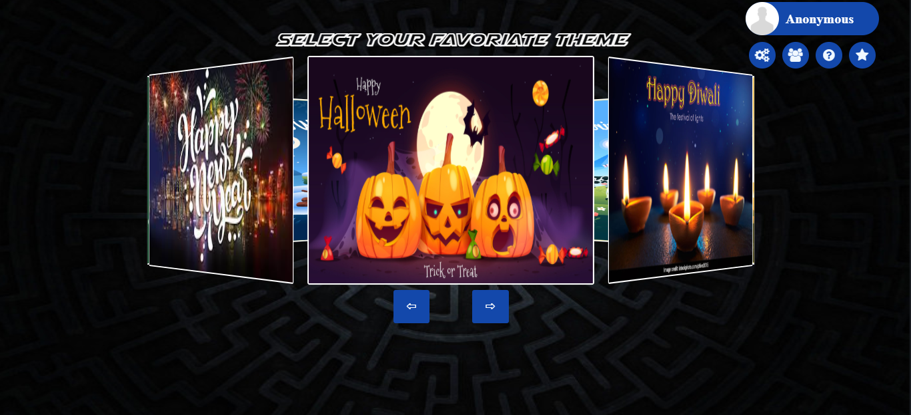
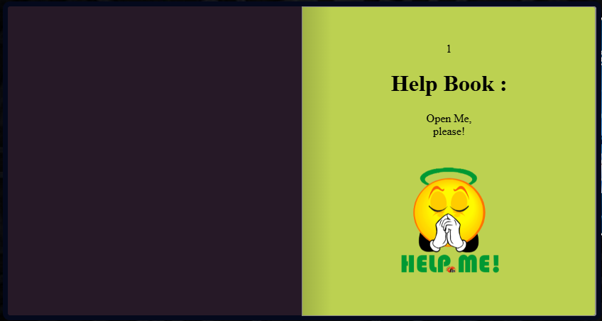
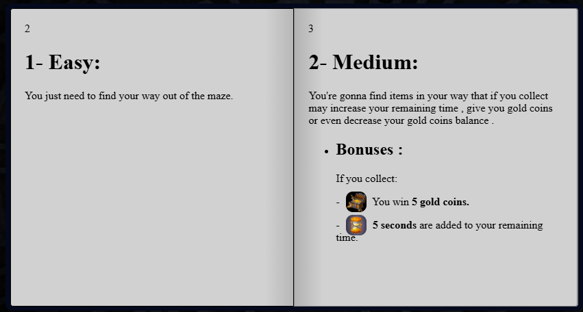
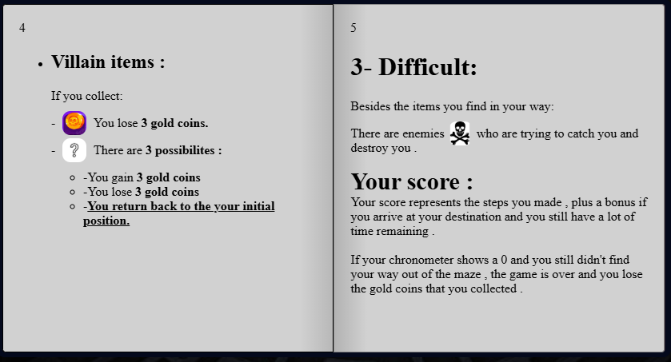
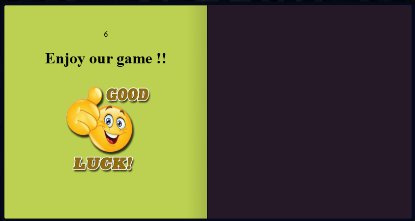
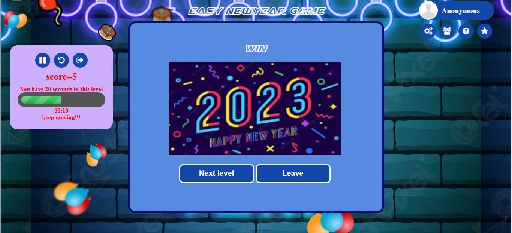
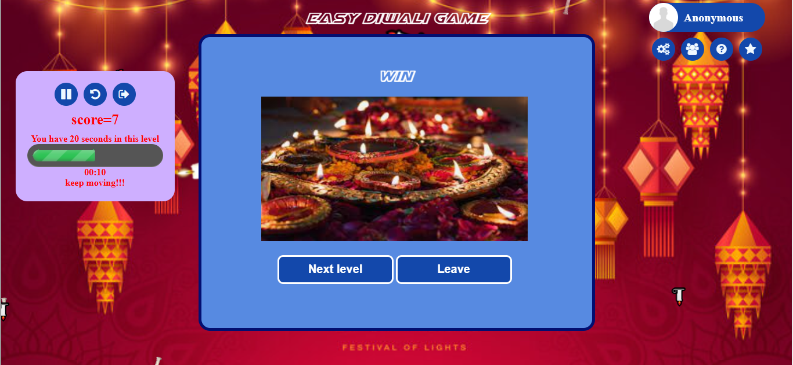
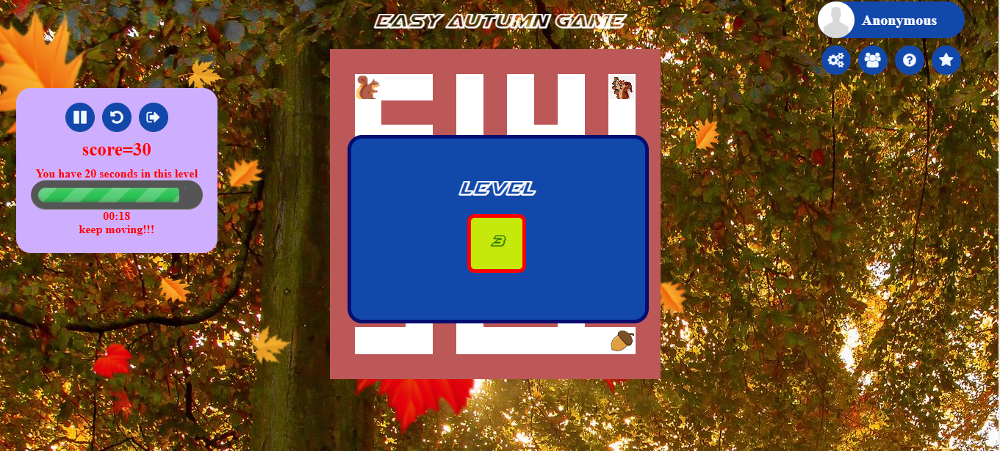

# Maze World Game

A captivating web-based maze game featuring multiple difficulty levels, seasonal themes, and engaging gameplay mechanics. Navigate through challenging mazes while collecting treasures and avoiding obstacles!

## Game Features

### Difficulty Levels
- **Easy**: Simple maze navigation — find your way to the exit.
- **Medium**: Navigate mazes while collecting bonus items and avoiding penalties.
- **Difficult**: Advanced gameplay with moving enemies and complex challenges.

### Game Elements
- **Collectible Items**:
  - 🏆 Treasure chests: +5 gold coins
  - ⏰ Time bonuses: +5 seconds
  - 💀 Penalty items: -3 gold coins
  - 🎲 Mystery items: Random effects (gain/lose coins or return to start)
- **Enemies**: Moving threats that chase the player (difficult mode)
- **Timer System**: Race against time to complete each level
- **Scoring System**: Based on steps taken and remaining time

## Themes & Customization

<table>
  <tr>
    <td align="center">🍂 Autumn</td>
    <td align="center">🌸 Spring</td>
    <td align="center">☀️ Summer</td>
    <td align="center">❄️ Winter</td>
  </tr>
  <tr>
    <td align="center">🎄 Christmas</td>
    <td align="center">🎊 New Year</td>
    <td align="center">🎃 Halloween</td>
    <td align="center">🪔 Diwali</td>
  </tr>
</table>

- **Avatar Selection**: Choose from 8 different avatars.
- **Color Schemes**: 12 UI color options.
- **Background Music**: Toggle game soundtrack on/off.
- **Personalization**: Custom player names.

## Game Screenshots

### Loading Screen
*Initial loading screen with game branding.*

  

### User Profile & Login

<table>
  <tr>
    <td>
      <ul>
        <li>Avatar selection gallery</li>
        <li>Username customization</li>
        <li>Profile management</li>
      </ul>
    </td>
    <td>
      
    </td>
  </tr>
</table>

### Theme Selection

  
  

  

- Carousel-style theme browser.
- Preview images for each seasonal theme.
- Easy theme switching.

### Main Menu & Navigation
*Main menu with difficulty selection and navigation options.* 

  

### Game Controls & Gameplay

  
  

  

- **Play/Pause**: Pause and resume gameplay.  
- **Restart**: Reset current level.  
- **Leave**: Exit to main menu.  
- **Timer Display**: Shows remaining time and level progress.  
- Real-time maze navigation with collectible items.  
- Score tracking and interactive visual feedback.

### Settings Panel

<table>
  <tr>
    <td>
      <ul>
        <li>Color customization grid</li>
        <li>Music controls</li>
        <li>User preferences management</li>
      </ul>
    </td>
    <td>
      
    </td>
  </tr>
</table>

### Help System

  
  

  

  
  

  

- Interactive help book with page navigation.  
- Detailed gameplay instructions.  
- Visual guides for game elements and scoring.

### Rating & Feedback System

<table>
  <tr>
    <td>
      <ul>
        <li>5-star rating system</li>
        <li>Comment section for suggestions</li>
        <li>Built-in feedback collection to improve future versions</li>
      </ul>
    </td>
    <td>
      
    </td>
  </tr>
</table>

### About Us Section

<table>
  <tr>
    <td>
      <ul>
        <li>Developer information and project credits</li>
        <li>Student project showcase from ENSIT</li>
      </ul>
    </td>
    <td>
      
    </td>
  </tr>
</table>

### Game Results
*Victory screen with level progression options.*

  
  

  

<table>
  <tr>
    <td>
      
*Game over screen with restart options*

    </td>
    <td>
      
    </td>
  </tr>
  <tr>
    <td>
      
*Level and progression screen*

    </td>
    <td>
      
    </td>
  </tr>
</table>

---

## Prerequisites
- Modern web browser with JavaScript enabled.
- No additional installations required.

## Running the Game
1. Open `index.html` in your web browser.  
2. Wait for the loading screen to complete.  
3. Choose your avatar and enter your name (optional).  
4. Select a difficulty level to start playing.  
5. Use arrow keys or WASD to navigate the maze.

## Game Controls
- **Movement**: Arrow keys or WASD.  
- **Pause**: Click pause button or press Space.  
- **Restart**: Click restart button.  
- **Menu**: Click leave button to return to main menu.

---

**Enjoy navigating through the Maze World! 🎮✨**